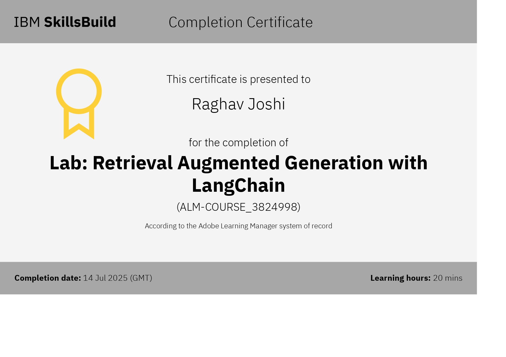
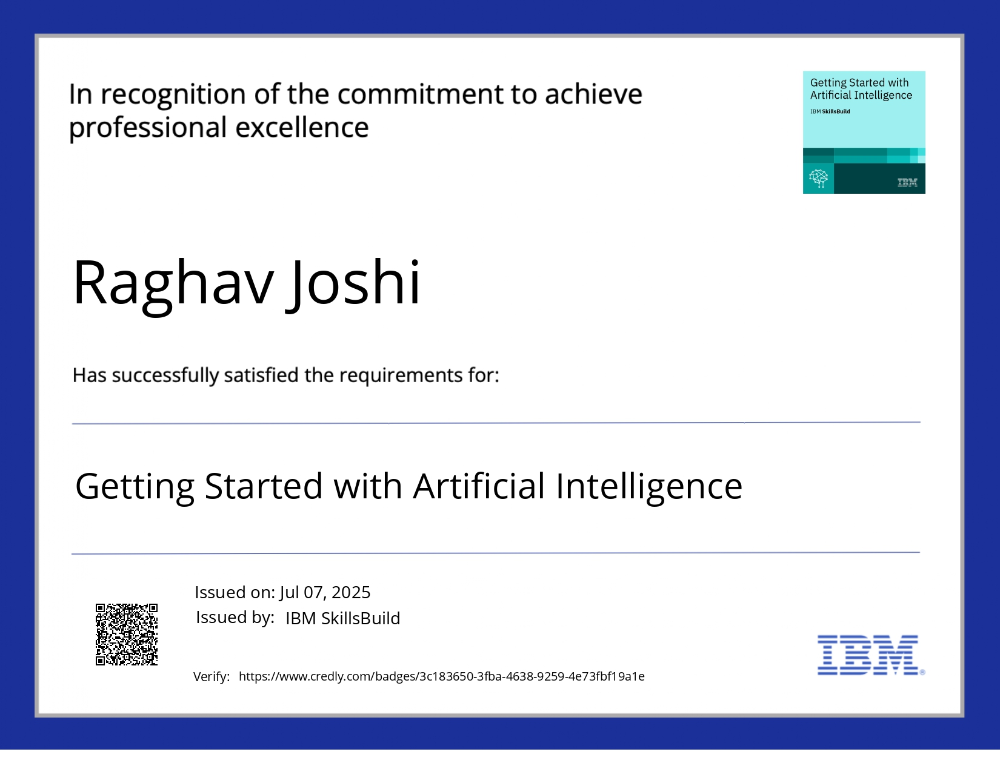
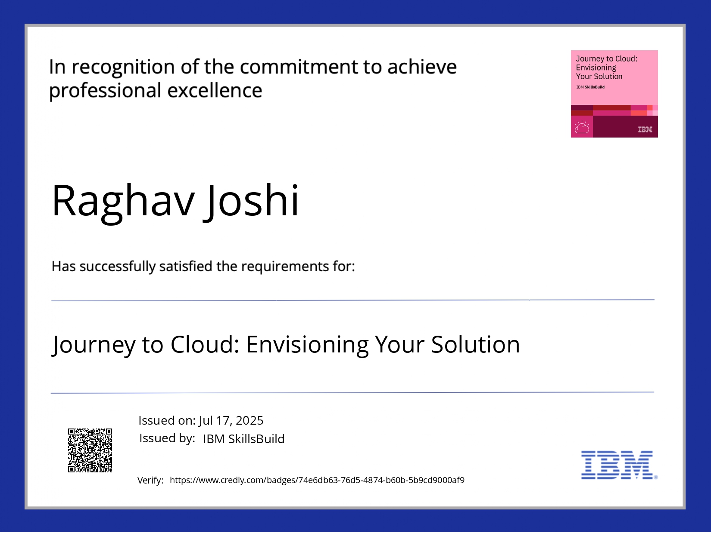

# 🔧 Predictive Maintenance of Industrial Machinery using IBM Watsonx.ai

This repository contains the code, assets, and documentation for a capstone project focused on predicting industrial machinery failures using machine learning, deployed on the IBM Cloud platform via Watsonx.ai.

---

## 📌 1. Problem Statement

The goal is to build a robust predictive maintenance system for industrial equipment. By analyzing real-time sensor data, the model anticipates potential equipment failures before they occur. This proactive approach aims to:

- Reduce operational costs  
- Increase equipment uptime  
- Minimize unscheduled downtime  

---

## 💡 2. Proposed Solution

We used IBM Watsonx.ai's **AutoAI** capability to automate the development of a machine learning pipeline. The AutoML system handles:

- Data preprocessing  
- Feature selection  
- Algorithm comparison  
- Hyperparameter tuning  
- Model evaluation & optimization  

---

## 🛠️ 3. System Development Approach

This project was developed entirely on **IBM Cloud**, using the following tools and steps:

**Platform:** IBM Watsonx.ai  
**Tool Used:** AutoAI within Watson Studio

### 📂 End-to-End Workflow:

1. **Data Ingestion**  
   Upload the predictive maintenance dataset to the IBM Cloud project.

2. **Model Building**  
   Use AutoAI to automatically generate and evaluate multiple machine learning pipelines.

3. **Model Selection**  
   Select the top-performing model pipeline based on evaluation metrics.

4. **Deployment**  
   Deploy the selected model as a live web service via Watson Machine Learning.

---

## 🧠 4. Algorithm & Model Selection

AutoAI determined that the **Gradient Boosting Classifier** performed best, with:

- **Accuracy:** 99.6%  
- **Rank:** #1 on AutoAI leaderboard  

This model was chosen based on evaluation metrics including precision, recall, and F1-score.

---

## 📊 5. Model Performance

The model showed high accuracy across various failure types:

- ✅ Thousands of *"No Failure"* predictions were correctly classified  
- ✅ Accurately detected specific failure types, including:  
  - Heat Dissipation Failure  
  - Power Failure  

### 🔍 Key Predictive Features:

- Torque  
- Rotational Speed  
- Tool Wear  

These were the top contributing features based on model explainability metrics.

---

## 🚀 6. Deployment & Live Results

The final model was deployed as a **live web service** on IBM Cloud. When tested with real-time sensor input, it confidently predicted `"No Failure"` outcomes with high reliability.

---

## 💻 7. AutoAI-Generated Notebook

The Python code for the best-performing model pipeline (**Gradient Boosting Classifier**) is available in a Jupyter Notebook. This notebook was automatically generated by IBM's AutoAI and provides a detailed, step-by-step look at the data preprocessing, feature engineering, and model training process.

📘 [View the notebook here](predictive_maintenance_model.ipynb.ipynb)

---

## ✅ 8. Conclusion

This project successfully demonstrates:

- High-accuracy ML-based predictive maintenance  
- Full automation of model building and deployment using IBM Watsonx.ai  
- Real-world readiness for industrial IoT environments  

---

## 🔭 9. Future Scope

The system can be further extended to:

- 🔄 Integrate with live industrial data streams  
- ⏱️ Predict Remaining Useful Life (RUL)  
- 🧠 Offer prescriptive maintenance recommendations  
- 📊 Visualize machine health via a real-time dashboard  

---

## 🧪 10. Certifications & Skills Acquired

The following certifications were completed through **IBM SkillsBuild** as part of this project:

- **Getting Started with Artificial Intelligence**  
- **Journey to Cloud: Envisioning Your Solution**  
- **Lab: Retrieval Augmented Generation with LangChain**

### 🖼️ Certificate Previews (Resized)

#### 🧠 Lab: Retrieval Augmented Generation with LangChain  

#### 🤖 Getting Started with Artificial Intelligence  

#### ☁️ Journey to Cloud: Envisioning Your Solution  

---

## 📚 11. References

- **Dataset**: [Predictive Maintenance Classification Dataset on Kaggle](https://www.kaggle.com/datasets)  
- **Project Source**: Provided by **IBM SkillsBuild for Academia** & **Edunet Foundation**  

---

> © 2025 — Built with IBM Watsonx.ai and real-world industrial data. Contributions welcome.
